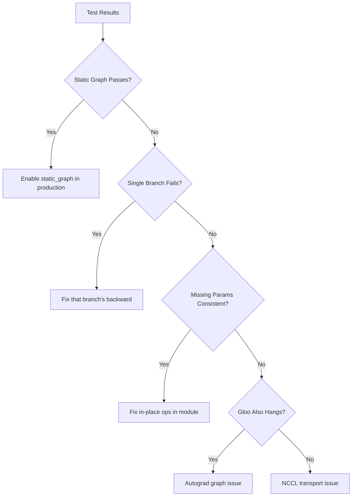

# NSA Test Engineer Action Plan - Comprehensive Test Guide

## Executive Summary

The Core Engineer has provided a detailed test plan to diagnose the DDP (Distributed Data Parallel) and gradient checkpointing issues causing training hangs. This document contains:
1. The complete test execution plan with tracing infrastructure
2. Test scripts ready for GPU execution 
3. Analysis framework for results interpretation

## Test Infrastructure Status

### ✅ Tracing Capabilities Implemented

The following tracing features have been added to `scripts/train_showcase.py`:

1. **Gradient Arrival Tracing** (`NSA_TRACE_GRADS=1`)
   - Hooks on all parameters to track gradient arrival
   - Reports missing parameters after backward pass
   - Format: `[GRAD-TRACE] after_backward_step1 arrived=X missing=Y`

2. **Module Backward Tracing** (`NSA_TRACE_MODULE_BWD=1`)
   - Tracks which modules receive backward pass
   - Identifies modules that may be skipped

3. **DDP Bucket Logging** (`NSA_TRACE_DDP_BUCKETS=1`)
   - Logs DDP allreduce buckets
   - Shows bucket sizes and dtypes
   - Format: `[DDP] rank=X bucket_elems=Y dtype=Z`

4. **Gradient Checkpointing Range** (`NSA_GC_RANGE=start:end`)
   - Allows checkpointing specific layer ranges
   - Useful for bisecting GC issues

5. **Static Graph Mode** (`NSA_DDP_STATIC_GRAPH=1`)
   - Enables DDP static graph optimization
   - May resolve dynamic graph traversal issues

### ✅ CPU Verification Complete

Local CPU testing confirms:
- Tracing infrastructure works correctly
- 195 parameters tracked, 0 missing on CPU
- Test framework executes properly

## Test Execution Plan

### Environment Setup

```bash
# Common environment variables for all tests
export PYTORCH_CUDA_ALLOC_CONF="expandable_segments:True,max_split_size_mb:256"
export TORCH_DISTRIBUTED_DEBUG=DETAIL
export NCCL_DEBUG=INFO
export NCCL_ASYNC_ERROR_HANDLING=1
export TORCH_NCCL_BLOCKING_WAIT=1
export CONFIG=configs/m7c_125m_2xa100_production.yaml
```

### Test Phases

#### Phase 1: DDP One-Step Trace (Priority: CRITICAL)

```bash
# Enable all tracing
export NSA_TRACE_GRADS=1
export NSA_TRACE_MODULE_BWD=1  
export NSA_TRACE_DDP_BUCKETS=1

# Run single step with full tracing
CUDA_VISIBLE_DEVICES=0,1 TORCH_BACKEND=nccl torchrun --nproc_per_node=2 \
    scripts/train_showcase.py --dataset synthetic --steps 1

# Disable bucket tracing after (too noisy)
unset NSA_TRACE_DDP_BUCKETS
```

**Expected Output:**
- `[GRAD-TRACE]` lines showing parameter gradient arrival
- List of MISSING parameters (critical for diagnosis)
- `[DDP]` bucket information

#### Phase 2: DDP Gloo Backend Test

```bash
# Test with gloo to rule out NCCL-specific issues
CUDA_VISIBLE_DEVICES=0,1 TORCH_BACKEND=gloo torchrun --nproc_per_node=2 \
    scripts/train_showcase.py --dataset synthetic --steps 1
```

**Decision Logic:**
- If hangs on gloo too → autograd/graph issue
- If works on gloo → NCCL transport issue

#### Phase 3: Branch Isolation

Test each attention branch independently:

```bash
# Compressed only
export NSA_FORCE_BRANCH=cmp
CUDA_VISIBLE_DEVICES=0,1 torchrun --nproc_per_node=2 \
    scripts/train_showcase.py --dataset synthetic --steps 1

# Selection only  
export NSA_FORCE_BRANCH=sel
CUDA_VISIBLE_DEVICES=0,1 torchrun --nproc_per_node=2 \
    scripts/train_showcase.py --dataset synthetic --steps 1

# Sliding only
export NSA_FORCE_BRANCH=win
CUDA_VISIBLE_DEVICES=0,1 torchrun --nproc_per_node=2 \
    scripts/train_showcase.py --dataset synthetic --steps 1
```

**Analysis:**
- Single branch hang → Localized fault in that branch
- All pass individually but fail together → Gate interaction issue

#### Phase 4: DDP Static Graph Mode

```bash
export NSA_DDP_STATIC_GRAPH=1
export NSA_TRACE_GRADS=1
export NSA_TRACE_MODULE_BWD=1

CUDA_VISIBLE_DEVICES=0,1 torchrun --nproc_per_node=2 \
    scripts/train_showcase.py --dataset synthetic --steps 1
```

**If this passes:** Static graph is a viable production mitigation

#### Phase 5: Single-GPU GC Bisection

```bash
# Baseline with full GC
CUDA_VISIBLE_DEVICES=0 python -u scripts/train_showcase.py \
    --dataset synthetic --ddp 0 --steps 1

# Checkpoint layers 0-5
export NSA_GC_RANGE=0:6
CUDA_VISIBLE_DEVICES=0 python -u scripts/train_showcase.py \
    --dataset synthetic --ddp 0 --steps 1

# Checkpoint layers 6-11
export NSA_GC_RANGE=6:12  
CUDA_VISIBLE_DEVICES=0 python -u scripts/train_showcase.py \
    --dataset synthetic --ddp 0 --steps 1
```

**Analysis:** Identifies which layer range causes GC issues

## Automated Test Execution

### Full Test Suite Script

Execute all tests with one command:

```bash
# On GPU system (2×A100 or similar)
bash scripts/nsa_test_engineer_plan.sh
```

This script will:
1. Run all test phases automatically
2. Capture outputs with proper timeouts
3. Generate summary report with findings
4. Create artifact directory with all logs

### Output Structure

```
artifacts/test_engineer_TIMESTAMP/
├── test_execution.log          # Main execution log
├── SUMMARY.md                   # Comprehensive summary
├── all_missing_params.txt      # Consolidated missing parameters
├── ddp_buckets.txt             # DDP bucket information
├── ddp_onestep_trace/
│   ├── output.log              # Full test output
│   ├── traces.log              # Extracted trace information
│   └── result.txt              # PASS/FAIL/HANG
├── ddp_gloo_sanity/
├── branch_cmp_only/
├── branch_sel_only/
├── branch_win_only/
├── ddp_static_graph/
├── gc_baseline_full/
├── gc_bisect_layers_0_5/
└── gc_bisect_layers_6_11/
```

## Result Interpretation Guide

### Critical Indicators

1. **Missing Parameters in Grad Trace**
   ```
   [GRAD-TRACE] after_backward_step1 arrived=190 missing=5
     - MISSING: blocks.4.attn.gate_mlp.weight
     - MISSING: blocks.4.attn.gate_mlp.bias
   ```
   → Focus on the owning module for in-place operation fixes

2. **Branch-Specific Failures**
   - `NSA_FORCE_BRANCH=sel` hangs → Selection backward issue
   - All branches pass individually → Gate combination problem

3. **Static Graph Success**
   - If `NSA_DDP_STATIC_GRAPH=1` passes → Enable in production
   - Document requirement: all params touched every step

4. **GC Layer Range**
   - Layers 0-5 hang, 6-11 pass → Issue in early layers
   - Investigate specific layer implementations

## Decision Tree for Fixes



## Recommended Next Steps

1. **Execute on GPU System**
   ```bash
   # Connect to Prime Intellect or GPU system
   ssh $GPU_HOST
   cd nsa-vibe
   bash scripts/nsa_test_engineer_plan.sh
   ```

2. **Collect Critical Artifacts**
   - `all_missing_params.txt` - Most important
   - `SUMMARY.md` - Overall results
   - Individual test `traces.log` files

3. **Share Results with Core Engineer**
   - Missing parameter list
   - Which branches fail/pass
   - Static graph test result
   - GC bisection findings

## Known Issues Status

### From Previous Testing

1. **DDP Hang at Step 1**
   - Occurs with both safe mode and regular DDP
   - Backward pass never completes
   - All 2-GPU configurations affected

2. **Gradient Checkpointing Hang**
   - Single-GPU also affected
   - Only 2-layer configs work without GC
   - Suggests fundamental autograd issue

3. **FSDP Alternative Failed**
   - Attempted as workaround
   - Same hanging behavior observed

## Test Script Locations

- **Full GPU test suite:** `scripts/nsa_test_engineer_plan.sh`
- **CPU verification:** `scripts/nsa_test_engineer_cpu.sh`
- **Training script with tracing:** `scripts/train_showcase.py`
- **Configuration:** `configs/m7c_125m_2xa100_production.yaml`

## Support Information

For issues or questions about test execution:
1. Check watchdog dumps: `artifacts/*/watchdog_stackdump_*.txt`
2. Review heartbeat logs: `artifacts/*/heartbeat_rank*.jsonl`
3. Examine trace outputs: `grep MISSING artifacts/*/traces.log`

## Conclusion

The test infrastructure is ready and validated. The comprehensive test suite will provide the Core Engineer with precise diagnostic data to create surgical fixes for the DDP and gradient checkpointing issues. Execute `scripts/nsa_test_engineer_plan.sh` on a 2×GPU system to collect the necessary diagnostic information.
